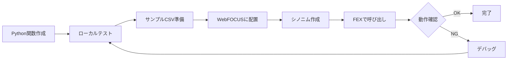

# WebFOCUS Python Function プロジェクト

このリポジトリは、WebFOCUSでPython関数を開発・利用するための包括的なプロジェクトです。

## 📁 プロジェクト構成

```
webfocus-python-function/
├── src/                # Pythonソースコード
│   ├── basic/         # 基本的な関数（算術演算、統計、文字列処理）
│   └── external/      # 外部API連携（X検索、Webスクレイピング）
│
├── synonyms/          # WebFOCUSシノニムファイル (.mas, .acx, .ftm)
│
├── samples/           # サンプルCSVデータ
│
├── docs/              # 開発ガイドドキュメント
│
├── tests/             # テストコード
│
├── tools/             # 開発ツールとスクリプト
│
├── outputs/           # 出力ファイル保存先
│
└── README.md          # このファイル
```

## 🚀 クイックスタート

### 1. 開発ガイドを読む

まずは[開発ガイド](docs/README.md)を参照して、WebFOCUS Python関数の基本を理解してください。

- **[概要](docs/01_overview.md)** - WebFOCUS Python関数とは
- **[環境構築](docs/02_environment_setup.md)** - 開発環境のセットアップ  
- **[開発ガイドライン](docs/03_development_guidelines.md)** - 関数の書き方とベストプラクティス
- **[シノニム作成](docs/04_synonym_creation.md)** - メタデータの作成方法

### 2. サンプルコードを確認

`src/`ディレクトリ内のPython関数を参照:

- **`src/basic/newfunc.py`** - 四則演算、中央値、偏差値計算
- **`src/basic/hensachi.py`** - ランク関数、ユニーク文字列抽出
- **`src/external/xsearch.py`** - X(旧Twitter)検索ツイート取得

### 3. ローカルテスト

Pythonファイルをローカルでテストするには:

```powershell
# サンプルCSVを使ってテスト
python src/basic/newfunc.py
```

または、テストランナーを使用:

```powershell
npm test
```

### 4. WebFOCUSにデプロイ

1. Python関数とシノニムを WebFOCUS サーバの`ibi_apps`ディレクトリに配置
2. WebFOCUS管理コンソールでシノニムを作成/更新
3. FEXファイルで PYTHON() 関数を呼び出し

詳細は[ツールディレクトリ](tools/)のデプロイガイドを参照してください。

## 📚 主な機能

### 基本関数 (`src/basic/`)

- **算術演算** - 四則演算
- **統計関数** - 中央値、偏差値、ランク付け
- **文字列処理** - ユニーク文字列抽出

### 外部連携 (`src/external/`)

- **X(旧Twitter)検索** - ツイート取得
- **Webスクレイピング** - HTML解析

## 🛠️ 必要な環境

- **Python**: 3.6.x（WebFOCUS同梱版推奨）
- **WebFOCUS**: Reporting Server 8.2以降
- **必須パッケージ**:  numpy, scipy, scikit-learn, pandas
- **追加パッケージ**: requests（外部API連携時）

## 📖 ドキュメント

すべてのドキュメントは[`docs/`](docs/)ディレクトリにあります:

1. [概要と導入](docs/01_overview.md)
2. [環境構築](docs/02_environment_setup.md)
3. [開発ガイドライン](docs/03_development_guidelines.md)
4. [シノニム作成](docs/04_synonym_creation.md)
5. [ライブラリ管理](docs/05_library_management.md)
6. [コードサンプル集](docs/06_code_samples.md)
7. [トラブルシューティング](docs/07_troubleshooting.md)

## 🔧 開発フロー



## 💡 使用例

### WebFOCUSからPython関数を呼び出す

```focexec
TABLE FILE DATASOURCE
COMPUTE RESULT/I9 = PYTHON(python/newfunc_kakezan, COL1, COL2, seki);
END
```

### ローカルでPython関数をテスト

```python
# テスト用
if __name__ == '__main__':
    kakezan('samples/basic/sample.csv', 'outputs/test_output.csv')
```

## 📝 ライセンス

このプロジェクトは開発者向けの参考資料として提供されています。

## 🔗 参考資料

- [WebFOCUS公式ドキュメント](https://webfocusinfocenter.informationbuilders.com/wfappent/TL5s/TL_srv_adapters/source/python1_using.htm)
- [Zenn記事 - WebFOCUSでPython関数を利用する](https://zenn.dev/shimokado/articles/2f8634331686b4)
- [WebFOCUS Python Adapter Manual](docs/09_reference_python_adapter.md) - WebFOCUS Pythonアダプターの公式リファレンス（ローカル版）

## 🤝 コントリビューション

プロジェクトへのコントリビューションを歓迎します。issueやpull requestをお気軽に作成してください。