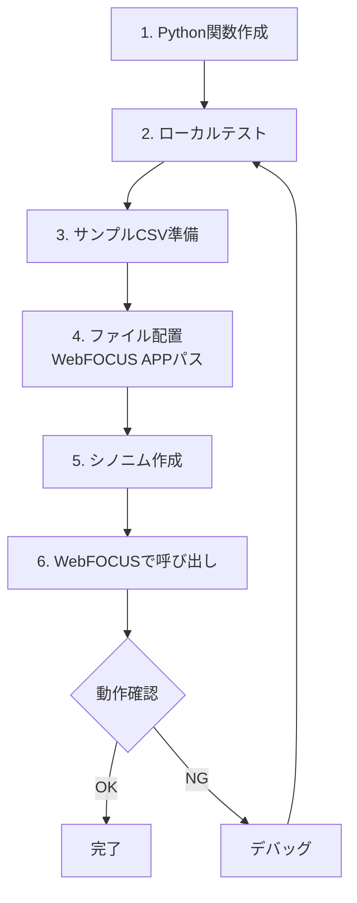

# WebFOCUS Python関数 - 概要と導入

## WebFOCUS Python関数とは

WebFOCUSのPythonアダプタは、ユーザーが作成したPython関数をWebFOCUSのレポート、ダッシュボード、チャート内で実行できるようにする機能です。Python標準ライブラリや追加パッケージの豊富な機能を活用して、WebFOCUS内でデータ処理や計算を行うことができます。

## できること

### 1. データ解析
- **pandas**などのライブラリを使った高度なデータ分析
- 統計処理（numpy, scipy）
- 機械学習（scikit-learn）

### 2. 自動化
- サーバサイドで動作するサブルーチンの実装
- バッチ処理の効率化
- データ変換処理の自動化

### 3. 情報収集
- Webスクレイピングによる外部データ取得
- APIとの連携
- リアルタイムデータ取得

### 4. カスタム計算
- WebFOCUS標準機能では実装困難な複雑な計算
- 独自のビジネスロジックの実装
- カスタム集計関数

## アーキテクチャ


### 処理フロー

1. **WebFOCUS側**: `COMPUTE`文でPYTHON関数を呼び出し
2. **アダプタ**: 入力データを一時CSVファイル（`csvin`）に書き込み
3. **Python実行**: 指定された関数が`csvin`を読み込み、処理を実行
4. **結果出力**: 結果を一時CSVファイル（`csvout`）に書き込み
5. **WebFOCUS側**: `csvout`から結果を読み込み、計算フィールドとして使用

> [!NOTE]
> 一時CSVファイルは自動的に作成・削除されるため、ユーザーが直接操作することはありません。

## 基本構文

### WebFOCUS側での呼び出し

```focexec
COMPUTE output_field/format = PYTHON(app/synonym, input1, input2, output_column);
```

**パラメータ説明:**
- `app/synonym`: アプリケーション名/シノニム名
- `input1, input2, ...`: Python関数に渡す入力フィールド（任意の個数）
- `output_column`: Python関数が出力するCSVの列名

### Python関数の基本構造

```python
import csv

def function_name(csvin, csvout):
    with open(csvin, 'r', newline='') as file_in, \
         open(csvout, 'w', newline='') as file_out:
        
        # フィールド名の定義
        fieldnames = ['result']
        
        # リーダー/ライターの設定
        reader = csv.DictReader(file_in, quoting=csv.QUOTE_NONNUMERIC)
        writer = csv.DictWriter(file_out, quoting=csv.QUOTE_NONNUMERIC,
                                fieldnames=fieldnames)
        
        # ヘッダー書き込み
        writer.writeheader()
        
        # データ処理
        for row in reader:
            # 処理ロジック
            result = row['input1'] + row['input2']
            writer.writerow({'result': result})
```

## 利用例

### 例1: 四則演算

```python
# WebFOCUS呼び出し
COMPUTE SUM/I9 = PYTHON(python/calc, NUM1, NUM2, addition);

# Python関数
def calculator(csvin, csvout):
    with open(csvin, 'r', newline='') as file_in, \
         open(csvout, 'w', newline='') as file_out:
        fieldnames = ['addition']
        reader = csv.DictReader(file_in, quoting=csv.QUOTE_NONNUMERIC)
        writer = csv.DictWriter(file_out, quoting=csv.QUOTE_NONNUMERIC,
                                fieldnames=fieldnames)
        writer.writeheader()
        
        for row in reader:
            result = row['col1'] + row['col2']
            writer.writerow({'addition': result})
```

### 例2: 外部APIからのデータ取得

```python
import csv
import requests

def fetch_data(csvin, csvout):
    with open(csvin, 'r', newline='', encoding='utf-8') as file_in, \
         open(csvout, 'w', newline='', encoding='utf-8') as file_out:
        
        fieldnames = ['response']
        reader = csv.DictReader(file_in)
        writer = csv.DictWriter(file_out, fieldnames=fieldnames)
        writer.writeheader()
        
        for row in reader:
            url = row['api_url']
            response = requests.get(url)
            writer.writerow({'response': response.text})
```

## 開発サイクル



## 次のステップ

- **環境構築**: [02_environment_setup.md](02_environment_setup.md)で環境のセットアップ方法を確認
- **開発ガイドライン**: [03_development_guidelines.md](03_development_guidelines.md)で詳細な開発規約を学習
- **サンプルコード**: [06_code_samples.md](06_code_samples.md)で実用的な例を参照
- **ローカルマニュアル**:
  - [WebFOCUS Python Adapter Manual](09_reference_python_adapter.md)
