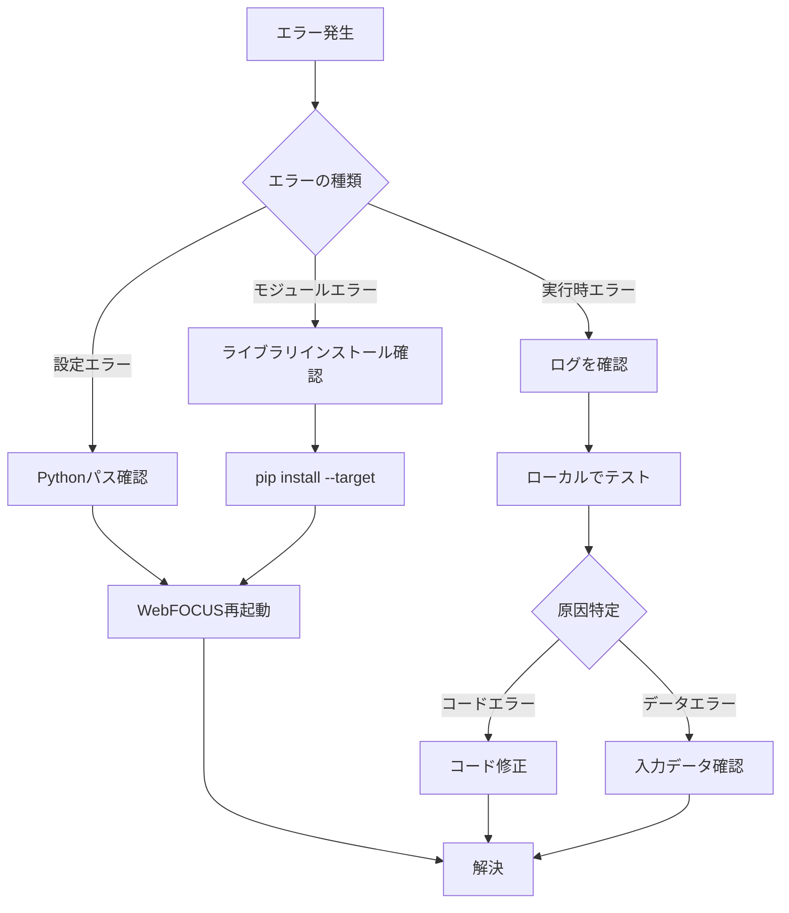

# トラブルシューティング

WebFOCUS Python関数開発時によく遭遇する問題と解決方法をまとめます。

## インストール・設定関連

### 1. Pythonアダプタが設定できない

**症状:**
```
Failed to configure Python adapter
```

**原因と解決策:**

| 原因 | 解決策 |
|------|--------|
| Pythonパスが間違っている | ・正しいPythonインストールディレクトリを指定<br>・WebFOCUS同梱版: `C:\ibi\srv90\home\etc\python` |
| Pythonバージョンが3.6.x以外 | ・Python 3.6.xをインストール<br>・WebFOCUS同梱版を使用（推奨） |
| ビットサイズが不一致 | ・WebFOCUSサーバと同じビットサイズ（32-bitまたは64-bit）のPythonを使用 |
| 必須パッケージ未インストール | ・numpy, scipy, scikit-learn, pandasを順にインストール |

### 2. パッケージが見つからない

**症状:**
```
ModuleNotFoundError: No module named 'xxx'
```

**解決策:**
```powershell
# 1. WebFOCUS同梱のPythonで正しくインストール
C:\ibi\srv90\home\etc\python\python.exe -m pip install --target=C:\ibi\srv90\home\etc\python\lib\site-packages <package_name>

# 2. インストール確認
C:\ibi\srv90\home\etc\python\python.exe -m pip list

# 3. WebFOCUS Reporting Serverを再起動
Restart-Service -Name "WebFOCUS Reporting Server"
```

> [!IMPORTANT]
> `--target`オプションを忘れないでください。これがないとWebFOCUSから参照できません。

## シノニム作成関連

### 3. シノニム作成時に「Function not found」エラー

**症状:**
```
Function 'xxx' not found in script
```

**チェックリスト:**
- [ ] Pythonスクリプトが正しいパスに配置されているか
- [ ] 関数名が正しく定義されているか
- [ ] 関数のシグネチャが`def function_name(csvin, csvout):`になっているか
- [ ] インデントエラーがないか

**正しい例:**
```python
import csv

def my_function(csvin, csvout):  # OK
    pass

def my_function(input, output):  # NG: 引数名が違う
    pass
```

### 4. フィールド名が「FIELD_1」「FIELD_2」になる

**症状:**
Master Fileのフィールド名が自動生成される

**原因:**
サンプルCSVにヘッダー行がない、またはヘッダー設定が正しくない

**解決策:**
1. サンプルCSVの最初の行にヘッダーを追加
   ```csv
   "col1","col2","col3"
   1,2,3
   ```
2. シノニム作成時に「CSV files with header」の「Input」にチェック✅

### 5. データ型が正しく認識されない

**症状:**
数値フィールドが文字列として認識される

**解決策:**
1. サンプルCSVのデータ形式を確認
   - 数値は引用符なし: `123`
   - 文字列は引用符あり: `"text"`
2. Python関数で`quoting=csv.QUOTE_NONNUMERIC`を使用

## 実行時エラー

### 6. 行数不一致エラー

**症状:**
```
Row count mismatch between input and output
```

**原因:**
`csvout`の行数が`csvin`の行数と一致していない

**解決策:**
```python
# 間違い: 集計結果だけを出力
def bad_median(csvin, csvout):
    with open(csvin, 'r', newline='') as file_in, \
         open(csvout, 'w', newline='') as file_out:
        # ...
        median_value = calculate_median(data)
        writer.writerow({'median': median_value})  # NG: 1行だけ

# 正しい: 入力と同じ行数を出力
def good_median(csvin, csvout):
    with open(csvin, 'r', newline='') as file_in, \
         open(csvout, 'w', newline='') as file_out:
        # ...
        median_value = calculate_median(data)
        for _ in range(row_count):
            writer.writerow({'median': median_value})  # OK: 全行出力
```

### 7. 「Field not found in segment OUTPUT_DATA」エラー

**症状:**
```
Field 'XXX' not found in segment OUTPUT_DATA
```

**原因:**
WebFOCUSのPYTHON関数呼び出しで指定した`output_field`がMaster Fileに定義されていない

**解決策:**
1. Master File (.mas)を確認
   ```
   SEGMENT=OUTPUT_DATA, SEGTYPE=U, PARENT=INPUT_DATA, $
     FIELDNAME=ADDITION, ALIAS=addition, ...  # 大文字で定義
   ```
2. WebFOCUS側で大文字で指定
   ```focexec
   COMPUTE RESULT/I9 = PYTHON(python/calc, A, B, ADDITION);  # 大文字
   ```

> [!NOTE]
> Master FileのFIELDNAMEは大文字、WebFOCUS呼び出しも大文字で統一します。

### 8. ゼロ除算エラー

**症状:**
```
ZeroDivisionError: division by zero
```

**解決策:**
```python
def safe_division(csvin, csvout):
    with open(csvin, 'r', newline='') as file_in, \
         open(csvout, 'w', newline='') as file_out:
        
        fieldnames = ['result']
        reader = csv.DictReader(file_in, quoting=csv.QUOTE_NONNUMERIC)
        writer = csv.DictWriter(file_out, quoting=csv.QUOTE_NONNUMERIC,
                                fieldnames=fieldnames)
        writer.writeheader()
        
        for row in reader:
            a = row['numerator']
            b = row['denominator']
            
            # ゼロ除算を回避
            result = a / b if b != 0 else 0
            writer.writerow({'result': result})
```

### 9. 文字コードエラー

**症状:**
```
UnicodeDecodeError: 'utf-8' codec can't decode byte
```

**解決策:**
```python
# エンコーディングを明示
with open(csvin, 'r', newline='', encoding='utf-8') as file_in, \
     open(csvout, 'w', newline='', encoding='utf-8') as file_out:
    # ...
```

または、エラーを無視:
```python
with open(csvin, 'r', newline='', encoding='utf-8', errors='ignore') as file_in:
    # ...
```

## パフォーマンス問題

### 10. 処理が遅い

**症状:**
大量データで処理時間が長い

**最適化手法:**

#### 1. ストリーミング処理
```python
# 悪い例: 全データをメモリに読み込む
def slow_function(csvin, csvout):
    with open(csvin, 'r') as f:
        all_data = list(csv.DictReader(f))  # 全データ読み込み
    # 処理 ...

# 良い例: 行ごとに処理
def fast_function(csvin, csvout):
    with open(csvin, 'r') as file_in, \
         open(csvout, 'w') as file_out:
        reader = csv.DictReader(file_in)
        writer = csv.DictWriter(file_out, fieldnames=['result'])
        writer.writeheader()
        
        for row in reader:  # 1行ずつ処理
            result = process(row)
            writer.writerow({'result': result})
```

#### 2. pandasの活用
```python
import pandas as pd

def pandas_fast(csvin, csvout):
    # ベクトル化された処理で高速化
    df = pd.read_csv(csvin)
    df['result'] = df['col1'] * df['col2']  # ベクトル演算
    df[['result']].to_csv(csvout, index=False)
```

### 11. メモリ不足

**症状:**
```
MemoryError
```

**解決策:**
- チャンク処理で分割
- 不要なデータは即座に削除
- ジェネレータを活用

```python
def memory_efficient(csvin, csvout):
    with open(csvin, 'r', newline='') as file_in, \
         open(csvout, 'w', newline='') as file_out:
        
        reader = csv.DictReader(file_in, quoting=csv.QUOTE_NONNUMERIC)
        writer = csv.DictWriter(file_out, quoting=csv.QUOTE_NONNUMERIC,
                                fieldnames=['result'])
        writer.writeheader()
        
        # 行ごとに処理（メモリ効率良）
        for row in reader:
            result = heavy_computation(row)
            writer.writerow({'result': result})
            # rowは次のループで上書きされるため、メモリを節約
```

## デバッグ関連

### 12. エラーの原因がわからない

**ロギングを追加:**
```python
import logging

logging.basicConfig(
    filename='C:/ibi/srv90/ibi_apps/python/logs/debug.log',
    level=logging.DEBUG,
    format='%(asctime)s - %(levelname)s - %(message)s'
)

def debug_function(csvin, csvout):
    logging.info(f"Function started: csvin={csvin}")
    
    try:
        with open(csvin, 'r', newline='') as file_in:
            reader = csv.DictReader(file_in, quoting=csv.QUOTE_NONNUMERIC)
            
            for i, row in enumerate(reader):
                logging.debug(f"Processing row {i}: {row}")
                # 処理
                
    except Exception as e:
        logging.error(f"Error occurred: {str(e)}", exc_info=True)
        raise
```

### 13. ローカルでテスト

WebFOCUS環境外でテスト:
```python
import csv

def my_function(csvin, csvout):
    # 関数本体
    pass

if __name__ == '__main__':
    # ローカルテスト用
    test_csvin = 'C:/dev/test_input.csv'
    test_csvout = 'C:/dev/test_output.csv'
    
    my_function(test_csvin, test_csvout)
    
    # 結果を確認
    with open(test_csvout, 'r') as f:
        print(f.read())
```

## よくある質問

### Q1: 複数の出力フィールドを1回の呼び出しで取得できますか？

**A:** いいえ、PYTHON関数の呼び出しでは1つの`output_field`しか指定できません。複数のフィールドを取得するには、複数のCOMPUTE文を使用します。

```focexec
COMPUTE FIELD1/D7 = PYTHON(python/calc, A, B, output1);
COMPUTE FIELD2/D7 = PYTHON(python/calc, A, B, output2);
```

### Q2: グローバル変数は使えますか？

**A:** はい、ただし関数実行ごとに初期化されるため、データの永続化には使えません。

```python
# グローバル変数（関数実行ごとにリセット）
counter = 0

def increment(csvin, csvout):
    global counter
    counter += 1  # 毎回1になる（永続化されない）
    # ...
```

### Q3: ファイルを保存できますか？

**A:** はい、サーバ上のディレクトリに書き込み権限があれば可能です。

```python
def save_file(csvin, csvout):
    # ログファイルに追記
    with open('C:/ibi/srv90/ibi_apps/python/logs/data.log', 'a') as log:
        log.write(f"Processed at {datetime.now()}\n")
    # ...
```

### Q4: 処理時間を制限できますか？

**A:** Pythonコード内でタイムアウトを実装できます。

```python
import signal

class TimeoutError(Exception):
    pass

def timeout_handler(signum, frame):
    raise TimeoutError("Function timeout")

def timed_function(csvin, csvout):
    # 30秒でタイムアウト
    signal.signal(signal.SIGALRM, timeout_handler)
    signal.alarm(30)
    
    try:
        # 処理
        pass
    finally:
        signal.alarm(0)  # タイマーをリセット
```

## トラブルシューティングフローチャート



## サポートリソース

### 公式ドキュメント
- [WebFOCUS Python Adapter Documentation](https://webfocusinfocenter.informationbuilders.com/wfappent/TL5s/TL_srv_adapters/source/python1_using.htm)

### コミュニティ
- [Zenn - WebFOCUS Python関数記事](https://zenn.dev/shimokado/articles/2f8634331686b4)

### ログファイル
- WebFOCUSサーバログ: `C:\ibi\srv90\home\logs\`
- カスタムログ: 関数内で任意の場所に出力可能

## 次のステップ

- **[開発ガイドライン](03_development_guidelines.md)**: コーディング規約を再確認
- **[サンプルコード](06_code_samples.md)**: 動作するコード例を参照
