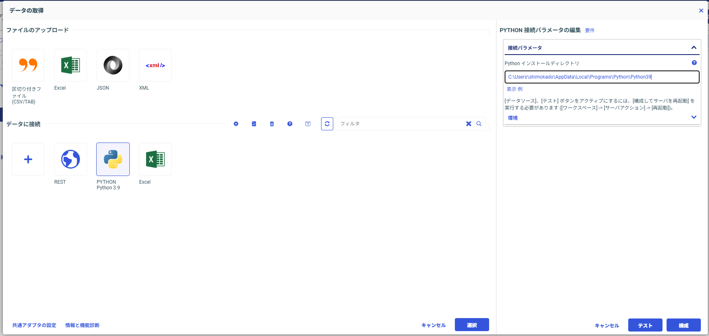
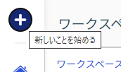
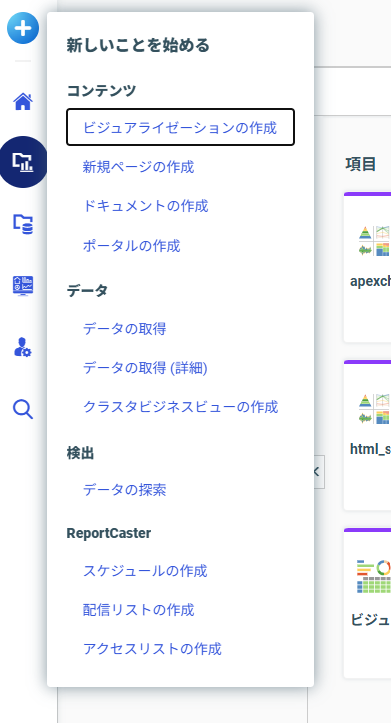
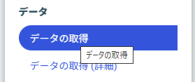
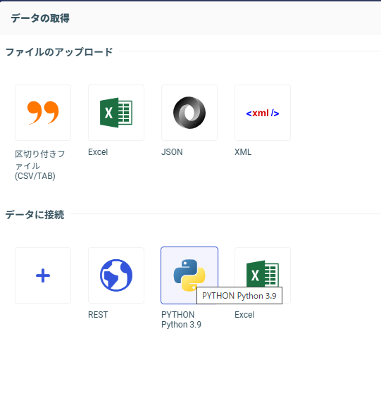
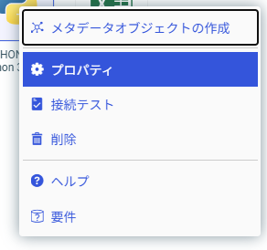
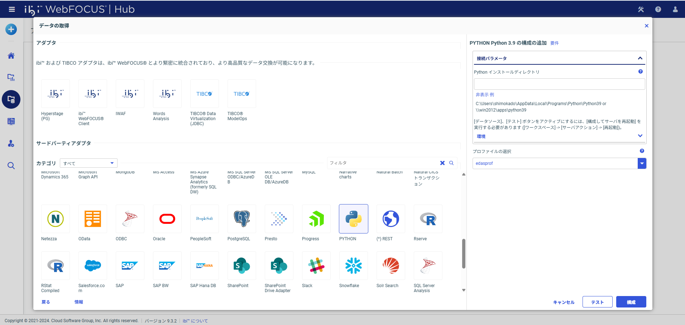
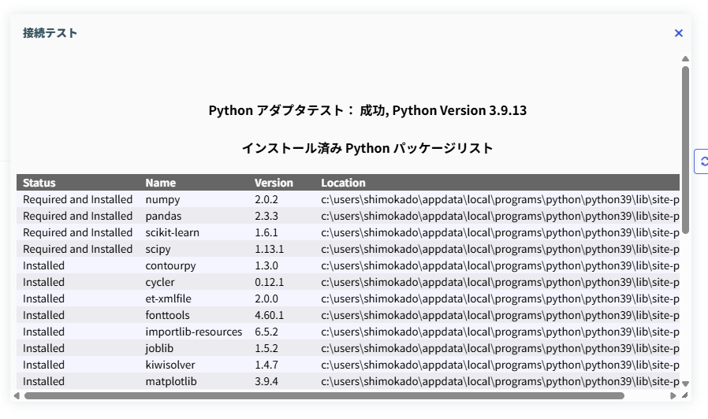
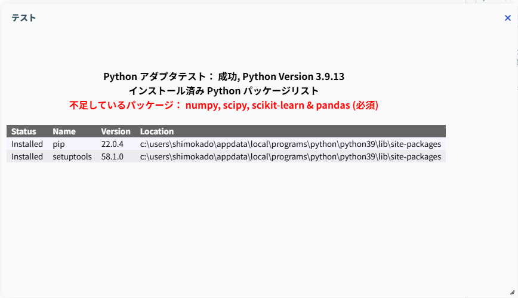

# WebFOCUS Pythonアダプタ設定ガイド

このガイドでは、WebFOCUSでPython関数を利用するための環境構築とアダプタ設定の手順を解説します。

## 1. Python環境の準備

WebFOCUSのPythonアダプタを使用するには、Python 3.9.xが必要です。

### 1.1 Pythonのインストール
- **バージョン**: Python 3.9.x (例: 3.9.13)
- **インストール先**: 任意のフォルダ (例: `C:\Users\shimokado\AppData\Local\Programs\Python\Python39`)
- **注意**: インストール時に「Add Python to PATH」にチェックを入れることを推奨します。

### 1.2 必須ライブラリのインストール

> [!WARNING]
> **Pythonバージョンの確認が重要です！**
> 
> システムに複数のPythonバージョンがインストールされている場合、環境変数PATHの設定やIDE設定によって、`python`コマンドで起動されるバージョンが異なる可能性があります。
> 
> WebFOCUSで使用する**Python 3.9.13**に対してライブラリをインストールする必要があります。

#### ステップ1: WebFOCUSが使用しているPythonパスを確認する

まず、WebFOCUSアダプタに設定されているPythonのパスを確認します。

1. WebFOCUS Hubでアダプタ設定画面を開きます（手順2を参照）
2. Pythonアダプタのプロパティを開きます
3. 表示されている「Pythonパス」をメモします（例: `C:\Users\shimokado\AppData\Local\Programs\Python\Python39`）



#### ステップ2: 現在の環境を確認する

PowerShellまたはコマンドプロンプトを開き、以下のコマンドで現在の`python`コマンドがどのバージョンを指しているか確認します。

```powershell
python --version
```

また、Pythonの実行ファイルの場所を確認します。

```powershell
where python
```

**確認結果の例:**
```
C:\Users\shimokado\AppData\Local\Programs\Python\Python313\python.exe  <- これが最初に見つかる
C:\Users\shimokado\AppData\Local\Programs\Python\Python39\python.exe   <- WebFOCUS用
```

> [!IMPORTANT]
> `where python`の結果が、WebFOCUSアダプタに設定したパスと**異なる場合**は、以下の方法1を使用してください。

#### ステップ2.5: WebFOCUS用Pythonのsite-packagesを確認する（重要）

ライブラリがインストールされる場所（site-packagesディレクトリ）を事前に確認することで、正しい場所にインストールされることを保証できます。

```powershell
# 手順1で確認したパスを使用
C:\Users\shimokado\AppData\Local\Programs\Python\Python39\python.exe -m site
```

出力例：
```
sys.path = [
    'C:\\Users\\shimokado',
    'C:\\Users\\shimokado\\AppData\\Local\\Programs\\Python\\Python39\\python39.zip',
    'C:\\Users\\shimokado\\AppData\\Local\\Programs\\Python\\Python39\\DLLs',
    'C:\\Users\\shimokado\\AppData\\Local\\Programs\\Python\\Python39\\lib',
    'C:\\Users\\shimokado\\AppData\\Local\\Programs\\Python\\Python39',
    'C:\\Users\\shimokado\\AppData\\Local\\Programs\\Python\\Python39\\lib\\site-packages',  <- ここにインストールされる
]
USER_BASE: 'C:\\Users\\shimokado\\AppData\\Roaming\\Python' (doesn't exist)
USER_SITE: 'C:\\Users\\shimokado\\AppData\\Roaming\\Python\\Python39\\site-packages' (doesn't exist)
```

> [!TIP]
> **重要な行:**
> - `lib\site-packages` で終わるパスがライブラリのインストール先です
> - この例では `C:\Users\shimokado\AppData\Local\Programs\Python\Python39\lib\site-packages`
> - このパスをメモしておき、後で検証に使用します

#### ステップ3: ライブラリのインストール

##### 方法1: 完全パスを指定してインストール（推奨・確実）

WebFOCUSアダプタに設定したPythonパスを使用して、確実にライブラリをインストールします。

```powershell
# 手順1で確認したパスを使用（例）
C:\Users\shimokado\AppData\Local\Programs\Python\Python39\python.exe -m pip install pandas numpy scipy scikit-learn matplotlib seaborn statsmodels xgboost openpyxl
```

> [!TIP]
> **パスの置き換え例:**
> - `C:\Users\shimokado\AppData\Local\Programs\Python\Python39` ← WebFOCUSアダプタ設定で確認したパス
> - 上記パスの末尾に `\python.exe` を追加します

##### 方法2: 環境が一致している場合

`python --version`と`where python`の結果が、WebFOCUSアダプタに設定したパスと一致している場合のみ、以下の簡易コマンドが使用できます。

```powershell
pip install pandas numpy scipy scikit-learn matplotlib seaborn statsmodels xgboost openpyxl
```

#### ステップ4: インストールの確認（必須）

ライブラリが正しいPython環境にインストールされたか、以下の3つの方法で確認します。

##### 確認方法1: インストール済みライブラリの一覧表示

```powershell
# 手順1で確認したパスを使用
C:\Users\shimokado\AppData\Local\Programs\Python\Python39\python.exe -m pip list
```

以下のライブラリが表示されればOKです：
- pandas
- numpy
- scipy
- scikit-learn
- matplotlib
- seaborn
- statsmodels
- xgboost
- openpyxl

##### 確認方法2: 特定のパッケージのインストール場所を確認（最も確実）

```powershell
# numpyを例に、インストール場所を確認
C:\Users\shimokado\AppData\Local\Programs\Python\Python39\python.exe -m pip show numpy
```

出力例：
```
Name: numpy
Version: 1.24.3
...
Location: C:\Users\shimokado\AppData\Local\Programs\Python\Python39\lib\site-packages
...
```

> [!IMPORTANT]
> **`Location:`の行を確認してください！**
> - この場所が、ステップ2.5で確認したsite-packagesと一致していれば正常です
> - 異なる場所（例: `Python313\lib\site-packages`）になっている場合は、間違ったPythonにインストールされています

**間違った場所にインストールされていた場合の対処:**
1. 間違った場所のライブラリをアンインストール
   ```powershell
   # 間違ったPythonを使ってアンインストール
   C:\Users\shimokado\AppData\Local\Programs\Python\Python313\python.exe -m pip uninstall numpy pandas scipy scikit-learn matplotlib seaborn statsmodels xgboost openpyxl -y
   ```
2. 正しいPythonのパスで再インストール（ステップ3に戻る）

##### 確認方法3: Pythonからインポートテスト

最終確認として、実際にPythonからライブラリをインポートできるかテストします。

```powershell
C:\Users\shimokado\AppData\Local\Programs\Python\Python39\python.exe -c "import pandas, numpy, scipy, sklearn, matplotlib, seaborn, statsmodels, xgboost, openpyxl; print('All libraries imported successfully!')"
```

成功すると以下が表示されます：
```
All libraries imported successfully!
```

エラーが表示される場合は、該当のライブラリが正しくインストールされていません。

> [!IMPORTANT]
> これらのライブラリが不足していると、アダプタの設定時にエラーが発生します（手順4参照）。
> また、venv（仮想環境）でも同じライブラリが必要になります。

### Python環境の使い分けガイド

WebFOCUS Python開発では、**2つの異なるPython環境**を使い分ける必要があります。

#### 環境の役割

| 環境 | 目的 | インストール先例 |
|------|------|------------------|
| **venv（仮想環境）** | ローカル開発・テスト実行 | `c:\dev\webfocus-python-function\venv\lib\site-packages` |
| **WebFOCUS用Python** | WebFOCUSでの本番実行 | `C:\Users\shimokado\AppData\Local\Programs\Python\Python39\lib\site-packages` |

> [!TIP]
> **両方の環境に同じライブラリをインストールする必要があります**
> - venv: `pytest`でテストを実行したり、VS Codeでコードを書いたりする際に使用
> - WebFOCUS用Python: WebFOCUSサーバーがPython関数を実行する際に使用

#### 判断基準：どの環境にインストールするか

**以下の表を参考に、目的に応じて適切な環境を選択してください：**

| あなたの作業 | インストール先 | 理由 |
|-------------|---------------|------|
| WebFOCUSで関数を実行 | **WebFOCUS用Python** | WebFOCUSサーバーがこのPythonを使用 |
| ローカルでテスト実行 (`pytest`) | **venv** | テストはvenv環境で実行 |
| VS Codeで開発 | **venv** | VS Codeがvenv環境を使用 |
| **完全な開発環境** | **両方** | ローカルテストも本番実行も必要 |

#### インストール手順

##### パターン1: WebFOCUS用Pythonのみにインストール

WebFOCUSでの実行のみが目的で、ローカルテストは不要な場合：

```powershell
C:\Users\shimokado\AppData\Local\Programs\Python\Python39\python.exe -m pip install pandas numpy scipy scikit-learn matplotlib seaborn statsmodels xgboost openpyxl
```

##### パターン2: venv（仮想環境）のみにインストール

ローカルでのテスト実行のみが目的の場合：

```powershell
# venvが有効化されていることを確認
pip install pandas numpy scipy scikit-learn matplotlib seaborn statsmodels xgboost openpyxl
```

または、venvのPythonを直接指定：

```powershell
.\venv\Scripts\python.exe -m pip install pandas numpy scipy scikit-learn matplotlib seaborn statsmodels xgboost openpyxl
```

##### パターン3: 両方の環境にインストール（推奨）

**完全な開発環境を構築する場合は、両方にインストールしてください：**

```powershell
# 1. WebFOCUS用Pythonにインストール
C:\Users\shimokado\AppData\Local\Programs\Python\Python39\python.exe -m pip install pandas numpy scipy scikit-learn matplotlib seaborn statsmodels xgboost openpyxl

# 2. venv環境にもインストール
.\venv\Scripts\python.exe -m pip install pandas numpy scipy scikit-learn matplotlib seaborn statsmodels xgboost openpyxl
```

#### よくある誤解とその解決

##### 🤔 「pip installしたのにWebFOCUSで動かない」

**症状:**

venv環境でライブラリをインストールしたが、WebFOCUSでPython関数を実行するとエラーになる。

```powershell
# venvにインストールした
PS C:\dev\webfocus-python-function> pip install pandas
Requirement already satisfied: pandas in c:\dev\webfocus-python-function\venv\lib\site-packages (2.3.3)

# でもWebFOCUS用Pythonには入っていない
PS C:\dev\webfocus-python-function> C:\Users\shimokado\AppData\Local\Programs\Python\Python39\python.exe -m pip list
Package    Version
---------- -------
pip        22.0.4
setuptools 58.1.0
```

**原因:**

VS Codeなどのエディタが自動的にvenv環境を有効化しているため、`pip install`がvenv内のPythonに対して実行され、WebFOCUS用Pythonにはインストールされていない。

**解決方法:**

WebFOCUS用Pythonの完全パスを指定してインストールします：

```powershell
C:\Users\shimokado\AppData\Local\Programs\Python\Python39\python.exe -m pip install pandas numpy scipy scikit-learn matplotlib seaborn statsmodels xgboost openpyxl
```

##### 🤔 「どちらの環境にインストールされたか確認したい」

各環境のsite-packagesを確認します：

```powershell
# WebFOCUS用Python
C:\Users\shimokado\AppData\Local\Programs\Python\Python39\python.exe -m pip list

# venv環境
.\venv\Scripts\python.exe -m pip list
```

または、特定のパッケージのインストール場所を確認：

```powershell
# WebFOCUS用Python
C:\Users\shimokado\AppData\Local\Programs\Python\Python39\python.exe -m pip show numpy

# venv環境
.\venv\Scripts\python.exe -m pip show numpy
```

`Location:`の行でインストール先を確認できます。

### 追加ライブラリの管理

WebFOCUS標準ライブラリ以外に追加のライブラリが必要になった場合の管理方法を説明します。

#### 基本原則

> [!IMPORTANT]
> **追加ライブラリは両方の環境にインストールする必要があります**
> - **venv環境**: ローカルでのテスト実行に必要
> - **WebFOCUS用Python**: WebFOCUSでの実行に必要
> - どちらか一方だけにインストールすると、環境によって動作が異なる問題が発生します

#### ベストプラクティス: requirements.txtで管理

プロジェクトで使用するライブラリは`requirements.txt`ファイルで一元管理することを強く推奨します。

##### 1. requirements.txtの作成・更新

プロジェクトルートの`requirements.txt`に必要なライブラリを記載します：

```text
# 基本ライブラリ（WebFOCUS標準）
pandas
numpy
scipy
scikit-learn
matplotlib
seaborn
statsmodels
xgboost
openpyxl

# 追加ライブラリ（プロジェクト固有）
requests>=2.31.0
beautifulsoup4>=4.12.0
pillow>=10.0.0
```

> [!TIP]
> **バージョン指定のベストプラクティス:**
> - `>=2.31.0`: 最小バージョンを指定（推奨）
> - `==2.31.0`: 特定バージョンに固定（互換性問題がある場合）
> - バージョン指定なし: 最新版をインストール（開発初期段階）

##### 2. 両環境への一括インストール

`requirements.txt`を使用して、両環境に同じライブラリをインストールします：

```powershell
# 1. WebFOCUS用Pythonにインストール
C:\Users\shimokado\AppData\Local\Programs\Python\Python39\python.exe -m pip install -r requirements.txt

# 2. venv環境にインストール
.\venv\Scripts\python.exe -m pip install -r requirements.txt
```

> [!NOTE]
> この方法により、両環境で完全に同じライブラリ構成を保証できます。

##### 3. requirements.txtの自動生成（既存環境から）

既にvenv環境にライブラリをインストール済みの場合、`requirements.txt`を自動生成できます：

```powershell
# venv環境からrequirements.txtを生成
.\venv\Scripts\python.exe -m pip freeze > requirements.txt
```

ただし、この方法は**すべての依存関係**を含むため、必要最低限のライブラリだけを記載する場合は手動編集してください。

#### 追加ライブラリのインストール手順（例）

新しいライブラリ（例: `requests`）を追加する場合の推奨手順：

**ステップ1: requirements.txtに追加**

```text
# 既存のライブラリ
pandas
numpy
...

# 新規追加
requests>=2.31.0
```

**ステップ2: 両環境にインストール**

```powershell
# WebFOCUS用Python
C:\Users\shimokado\AppData\Local\Programs\Python\Python39\python.exe -m pip install requests

# venv環境
.\venv\Scripts\python.exe -m pip install requests
```

**ステップ3: WebFOCUS Serverを再起動**

```powershell
# 管理者権限でPowerShellを実行
Restart-Service -Name "WebFOCUS 93 Server"
```

**ステップ4: 動作確認**

```powershell
# WebFOCUS用Pythonで確認
C:\Users\shimokado\AppData\Local\Programs\Python\Python39\python.exe -m pip show requests

# venv環境で確認
.\venv\Scripts\python.exe -m pip show requests
```

#### ライブラリ管理のチェックリスト

新しいライブラリを追加する際は、以下を確認してください：

- [ ] `requirements.txt`に追加した
- [ ] WebFOCUS用Pythonにインストールした
- [ ] venv環境にインストールした
- [ ] WebFOCUS Serverを再起動した（WebFOCUS用Pythonに追加した場合）
- [ ] 両環境でインストールを確認した（`pip show`）
- [ ] アダプタのテストで利用可能なライブラリとして表示されることを確認した

#### トラブルシューティング: 環境間の不一致

両環境でライブラリのバージョンが異なる場合、以下のコマンドで確認・修正できます：

```powershell
# 両環境のライブラリリストを比較
C:\Users\shimokado\AppData\Local\Programs\Python\Python39\python.exe -m pip list > webfocus_libs.txt
.\venv\Scripts\python.exe -m pip list > venv_libs.txt

# ファイルを比較（PowerShell）
Compare-Object (Get-Content webfocus_libs.txt) (Get-Content venv_libs.txt)
```

不一致が見つかった場合は、`requirements.txt`を使って両環境を再同期してください。


## 2. WebFOCUS Pythonアダプタの設定

WebFOCUS HubからPythonアダプタの設定を行います。

### 手順1: アダプタ設定画面を開く

1. WebFOCUS Hubにログインします。
2. 画面左上のメニューから「データ」または「アダプタ」を選択し、アダプタの設定画面に移動します。
   
   > [!TIP]
   > 以下の画像のように、画面左上の「テスト」ボタン（フラスコのアイコン）をクリックし、表示されるメニューから「データの取得」を選択することでもアクセスできます。

   
   
   
   
   

### 手順2: Pythonアダプタの選択

アダプタの一覧から「Python」を探して選択します。
まだ設定されていない場合は、プラスボタン（＋）を押して追加してください。



### 手順3: パスの設定

1. Pythonアイコンを右クリックし、「プロパティ」を選択します。

   

2. プロパティ画面が表示されます。ここでPythonの実行ファイル（`python.exe`）があるフォルダのパスを設定します。
   
   **設定例**: `C:\Users\shimokado\AppData\Local\Programs\Python\Python39`

   

   > [!NOTE]
   > このパスは、手順1.1でPythonをインストールした場所に合わせてください。

   

### 手順4: 接続テスト

> [!CAUTION]
> **重要: WebFOCUS Serverサービスの再起動が必要です**
> 
> ライブラリをインストールした後、**WebFOCUS Serverのサービスを再起動しないと、ライブラリが有効になりません**。
> 以下の手順を必ず実行してください。

#### ステップ1: WebFOCUS Serverサービスの再起動

ライブラリをインストールした後、以下のいずれかの方法でWebFOCUS Serverを再起動します。

##### 方法1: Windowsサービスから再起動

1. `Win + R` キーを押して「ファイル名を指定して実行」を開く
2. `services.msc` と入力してEnter
3. サービス一覧から「WebFOCUS Server」を探す
4. 右クリックして「再起動」を選択

##### 方法2: PowerShellから再起動（管理者権限が必要）

```powershell
# 管理者権限でPowerShellを開いて実行
Restart-Service -Name "WebFOCUS 93 Server"
```

> [!TIP]
> サービスの再起動には数十秒かかる場合があります。再起動完了を確認してから次の手順に進んでください。

#### ステップ2: アダプタの接続テスト

プロパティ画面の「テスト」ボタンをクリックして、設定が正しいか確認します。


##### テスト成功の場合

以下のように「利用可能なライブラリ」が表示されれば、設定は完了です！



表示されるライブラリ例：
- numpy
- pandas
- scipy
- scikit-learn
- matplotlib
- seaborn
- statsmodels
- xgboost
- openpyxl

> [!NOTE]
> この画面に表示されるライブラリは、WebFOCUSがPython関数の実行時に利用できるライブラリです。

##### テスト失敗の場合

以下のようなエラーメッセージが表示される場合は、対処が必要です。



**主な原因と対処法:**

1. **必須ライブラリが不足している**
   - 手順1.2に戻って、必要なライブラリをインストール
   - インストール後、必ずWebFOCUS Serverを再起動

2. **WebFOCUS Serverを再起動していない**
   - 上記の手順1を実行してサービスを再起動
   - 再起動後、もう一度テストボタンをクリック

3. **Pythonパスが間違っている**
   - 手順3に戻って、正しいPythonパスを設定
   - `python.exe`が存在するフォルダのパスを指定（`python.exe`自体は含めない）


## 3. 次のステップ

アダプタの設定が完了したら、実際にPython関数を作成して呼び出してみましょう。

- [Python関数サンプル解説](07_sample_explanation.md)
- [テストガイド](08_testing_guide.md)
